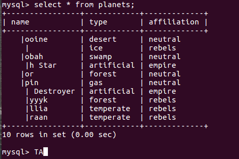

# SQL Homework
SQL homework for Introduction to Computer (計算機概論), Fall 2018

## Introduction

In this homework, you will learn some basic SQL commands.

On World Wide Web there are more than 100 different web pages dedicated to Star Wars. However, the answer to a specific trivia question is sometimes difficult to find, precisely because of the abundance of information. In this assignment we will be creating a new Star Wars Trilogy database for the trivial overs. We decided to begin with the time tables - who went where and when. We have started to input the information into the database. Your task will be to create SQL queries that answer some of the often asked questions (or questions that we found most fascinating and asked often). 


## Database

The database had three tables:
* characters: contains information about the character’s Name (primary key), Race (if known), Homeworld (if known) and Affiliation (rebels/empire/neutral/free-lancer). 
* planets: contains information about the planet’s Name (primary key), it’s Type (gas/swamp/forest/handmade/ice/desert), and it’s Affiliation (rebels/empire/neutral). 
* time_table: contains Character’s Name, Planet’s Name, Movie in which the character visited the planet and the time of arrival and departure from the planet. The primary key is Character’s Name, Planet’s Name and Movie. Movie 1 represents The Star Wars, Movie 2 represents Empire Strikes Back, and Movie 3 represents Return of the Jedi. Each movie has been divided into 10 time chunks and these chunks are used to define time of arrival and departure. So that, if Darth Vader visited Bespin
(Cloud City) in Empire Strikes Back from the middle of the movie till it’s end, the record of it will look like this: 

| character_name | planet_name | movie | time_of_arrival | time_of_departure |
|----------------|-------------|-------|-----------------|-------------------|
| Darth Vader    | Bespin      | 2     | 5               | 10                |


## Questions
You are asked to write SQL queries that answer the questions below (one query per question) and run them with MySQL.
1. Who had been to Endor in movie 3? 
2. How many planets did Luke Skywalker visit in movie 2? 
3. Who visited his/her homeworld in movie 3? 
4. Find all characters that never visited any empire planets. 
5. Find distinct names of the planets visited by rebels affiliated human. 
6. Show the characters names and the total time they spent in each planet among the movies. 
7. Find all characters that is rebels affiliates humans and his/her homeworld is known. 
8. On which planets and in which movies has Luke Skywalker been at the same time on the planet as anyone who is human? 
9. For each movie 1, 2, and 3, which character(s) visited the highest number of planets? 
10. Which planet has the longest staying time to the droid? 
11. Which planet(s) have not been visited by any characters in all movies (1, 2 and 3)? 
12. For Luke Skywalker, for each movie that Luke appears in, what is the planet that has the different affiliation with him and that he travels to for the longest length of time?
13. Who visited the planet Star Dagobah and leave later than Luke Skywalker? 
14. For each race, find the character that travels the most (number of time slots) in each movie 1, 2, 3. 

Note that
* The query answers must not contain duplicates
* For this assignment, **creation of temporary tables is not allowed**, i.e., for each question, you have to write exactly one SQL statement

## Submission
You have to hand in your report on Ceiba before 12/30 12:00 with the required format:

```
└── <your_student_ID>.zip
    ├── report.pdf
    └── sql_commands.txt

```
**Any invalid format (e.g., .rar/.7z ...) of the submission will result in 0 points.**

The report should contain fifteen queries: 
```
SQL Homework
StudentID & name

1. [Screenshot of the result of Query 1]

2. [Screenshot of the result of Query 2]
(...)
```
Please make it as simple as possible. 

**Any invalid format (e.g., .rar/.7z ..., missing report, missing screenshots) of the submission will result in 0 points.**

You could prevent this by adding some words in the next command:


Discussion is accepted but cheating is strictly prohibited. You must do the whole homework by yourself.


## Environment Setup

### MySQL

See https://dev.mysql.com/doc/mysql-installation-excerpt/5.7/en/

If you are using Linux, the following commands might work:
```
sudo apt-get update
sudo apt-get install mysql-server
# Check if mysql is up
sudo service mysql status
```

### OS/Conda/GitHub

See the instructions in the previous homework: https://github.com/amjltc295/PythonHomework#task-0-environment-setup

### Others

The following tools would **significantly** improve your coding efficiency if you learn how to use it. Please at least give [oh-my-zsh](https://github.com/robbyrussell/oh-my-zsh) a try.
* Install [oh-my-zsh](https://github.com/robbyrussell/oh-my-zsh). OMZ is a wonderful command line configuration. It includes auto-completion, alias, beautiful display and many more utilities.
* Use Vim > 8.0 and install good [vimrc](https://github.com/amix/vimrc)
* Install [ALE](https://github.com/w0rp/ale) for syntax/style check
* Install [YouCompleteMe](https://github.com/Valloric/YouCompleteMe) for code auto-completion
* Install [ack](https://github.com/beyondgrep/ack2) to search local code
* Use tmux and install [oh-my-tmux](https://github.com/gpakosz/.tmux)


## Grading

* 7 points for each qury (98%)
* Name and studentID in the report (2%)

**If your screenshot is found the same as another student, both of you will get 0 points.**

**Any invalid format (e.g., .rar/.7z ..., missing report, missing screenshots) of the submission will result in 0 points.**

## License

MIT


## Disclaimer

The database and questions are based on previous TA's work.

## Author

Ya-Liang Chang (Allen) [amjltc295](https://github.com/amjltc295)
